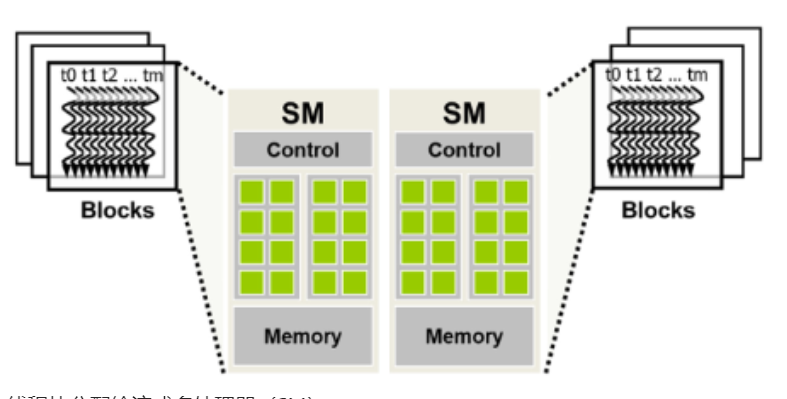

在CUDA编程模型中，**块调度（Block Scheduling）**是GPU执行模型的一个关键组成部分，它决定了如何将线程块（Thread Blocks）分配给流多处理器（Streaming Multiprocessors, SMs）以及如何在这些SMs上调度这些块以进行计算。理解块调度对于优化CUDA程序的性能至关重要，因为它涉及到如何有效地利用GPU的计算资源。

将线程逐块分配给 SM 保证了同一块中的线程在同一 SM 上同时调度。这种保证使得同一块中的线程能够以不同块中的线程无法实现的方式相互交互。这包括屏障同步，这将在第 4.3 节中讨论。它还包括访问驻留在 SM 上的低延迟共享内存，这将在第 5 章，内存架构和数据局部性中讨论

### 块调度的基本概念：

1. **线程块（Thread Block）**：是一组并行线程的集合，这些线程可以协同工作以完成一个共同的计算任务。线程块的大小（即包含的线程数量）通常是32、64或128，具体取决于GPU架构和程序的需求。

2. **流多处理器（SM）**：是GPU中负责执行线程的核心部分。每个SM可以执行多个线程块，但每个线程块必须完全在单个SM上执行。SM包含多个CUDA核心，可以并行执行多个线程。

3. **网格（Grid）**：是由多个线程块组成的二维或三维数组，用于组织和管理整个并行计算任务。

### 块调度的过程：

1. **分配线程块到SMs**：
   - 当一个内核函数被调用时，CUDA运行时系统会将线程块分配给可用的SMs。
   - 分配通常基于一种称为“轮询”的策略，即每个SM依次获得一个线程块，直到所有SM都被分配了线程块。

2. **线程块的执行**：
   - 一旦线程块被分配给SM，该SM上的所有线程将开始执行分配给它们的任务。
   - 线程块内的线程可以通过共享内存进行通信和同步，这是实现高效并行计算的关键。

3. **线程束分化（Warp Divergence）**：
   - 如果一个线程块内的线程执行不同的指令路径，这会导致线程束分化，从而降低执行效率。
   - 为了最小化线程束分化，应该尽量确保线程块内的线程尽可能执行相同的指令路径。

4. **动态并行（Dynamic Parallelism）**：
   - CUDA还支持动态并行，允许在GPU上动态启动新的内核函数，这些内核函数可以有自己的线程块和SM分配。

### 优化块调度的策略：

1. **确保线程块大小合适**：选择适合GPU架构和程序需求的线程块大小，以充分利用SM的计算资源。

2. **避免线程束分化**：设计内核函数时，尽量减少线程束分化，确保线程块内的线程尽可能执行相同的指令路径。

3. **利用共享内存**：合理使用共享内存来存储线程块内共享的数据，减少全局内存访问，提高数据访问速度。

4. **调整网格和块的大小**：根据问题的规模和GPU的资源，合理调整网格和块的大小，以优化资源利用和性能。

通过理解和优化块调度，程序员可以显著提高CUDA程序的性能，充分利用GPU的并行处理能力。

