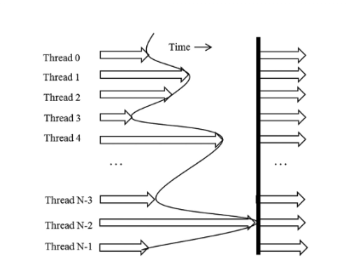
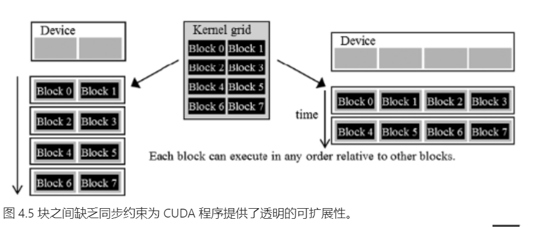

在CUDA编程模型中，**同步（Synchronization）**和**透明可扩展性（Transparent Scalability）**是两个核心概念，它们确保了并行计算的准确性和高效性。下面详细解释这两个概念：



相互之间，CUDA运行时系统可以相对于彼此以任何顺序执行块，因为它们都不需要相互等待。这种灵活性使可扩展的实现成为可能，如图4.5所示。图中的时间从上到下进行。在只有少量执行资源的低成本系统中，可以同时执行少量块，图4.5左侧描绘为一次执行两个块。在具有更多执行资源的更高端实现中，可以同时执行多个块，图4.5右侧描绘为一次执行四个块。今天的高端GPU可以同时执行数百个块。



### 4.3.1 同步（Synchronization）
同步是指在并行计算中，确保所有线程或线程块按照一定的顺序执行某些操作的过程。在CUDA中，同步通常涉及到以下几个方面：

1. **线程同步（Thread Synchronization）**：
   - 在同一个线程块内，线程可以通过`__syncthreads()`函数来同步它们的执行。这个函数会阻塞调用它的线程，直到同一个线程块内的所有线程都到达同步点。
   - 线程同步确保了在继续执行下一步计算之前，所有线程都已完成当前步骤的工作。

2. **块同步（Block Synchronization）**：
   - 在CUDA内核函数中，不同的线程块是并行执行的，通常不需要显式同步。
   - 但是，如果线程块之间需要协调操作（例如，当它们需要共享数据时），则必须使用全局内存和原子操作或其他同步机制来实现同步。

3. **内核函数同步（Kernel Function Synchronization）**：
   - 当使用同一个内核函数启动多个网格时，CUDA运行时会自动同步这些网格的执行。
   - 这意味着，只有当所有线程块都完成了它们的工作后，新的内核函数才会开始执行。

### 4.3.2 透明可扩展性（Transparent Scalability）

透明可扩展性是指CUDA程序能够在不同规模的GPU上运行，而无需对代码进行大量修改。这种可扩展性是通过CUDA的调度机制实现的：

1. **动态并行（Dynamic Parallelism）**：
   - CUDA支持动态并行，允许在GPU上动态启动新的内核函数。
   - 这种机制使得程序能够根据GPU的可用资源自动调整执行配置，从而实现透明可扩展性。

2. **资源管理（Resource Management）**：
   - CUDA运行时会自动管理GPU资源，如寄存器、共享内存和线程块大小，以适应不同的GPU和内核函数需求。
   - 程序员可以通过调整内核函数的启动参数来优化资源使用，但通常不需要担心底层的资源管理细节。

3. **执行配置（Execution Configuration）**：
   - 通过调整线程块的大小和网格的维度，程序员可以控制内核函数的执行方式。
   - CUDA运行时系统会根据GPU的SM数量和每个SM的线程数来动态分配线程块，从而实现透明可扩展性。

### 总结

同步和透明可扩展性是CUDA编程模型中确保并行计算正确性和性能的关键特性。同步确保了线程和线程块之间的协调，而透明可扩展性则允许程序在不同的GPU配置上高效运行。理解这些概念对于编写高效且可移植的CUDA程序至关重要。


这段代码是一个展示不正确使用`__syncthreads()`函数的示例。`__syncthreads()`是CUDA编程中用于线程同步的函数，它确保在它被调用之前的所有线程都已完成执行，才能继续执行后面的代码。这个函数只能在同一个线程块内的线程之间调用。正确使用`__syncthreads()`对于保证并行计算的正确性至关重要。

### 代码解释

```cuda
void incorrect_barrier_example(int n){
    // 假设 n 是线程块的大小
    if (threadIdx.x % 2 == 0) {
        __syncthreads(); // 正确的同步调用
    } else {
        __syncthreads() // 错误的使用，缺少下划线
    }
}
```

在这段代码中，有一个明显的错误：`else`分支中的`__syncthreads()`函数名错误地写成了`yncthreads()`（缺少下划线）。这会导致编译错误，因为`yncthreads()`并不是有效的CUDA函数。

### 正确使用`__syncthreads()`

`__syncthreads()`的正确使用方式是确保所有线程在继续执行之前都达到了同步点。这通常用于以下情况：

1. **保护共享资源访问**：当多个线程需要访问共享内存中的同一资源时，必须先同步，以确保所有线程读取到的数据是一致的。
2. **确保计算顺序**：在进行依赖于之前计算结果的计算前，需要同步，以保证所有线程都已完成其计算任务。

### 示例：正确使用`__syncthreads()`

假设我们有一个数组，每个线程块需要更新数组的不同部分，但在更新之前需要确保所有线程都已完成对数组的读取：

```cuda
__global__ void correct_barrier_example(int *data, int n) {
    int tid = threadIdx.x;
    int i = blockIdx.x * blockDim.x + threadIdx.x;

    // 读取数据
    int value = data[i];

    // 同步确保所有线程都已完成数据读取
    __syncthreads();

    // 更新数据
    data[i] = value + 1;

    // 再次同步确保所有线程都已完成数据更新
    __syncthreads();
}
```

在这个例子中，`__syncthreads()`确保了在更新数组之前，所有线程都已完成对数组的读取。这防止了数据竞争和不一致的情况发生。

### 总结

正确使用`__syncthreads()`是CUDA编程中的一个重要方面，它确保了线程之间的正确同步和数据的完整性。开发者必须确保在使用这个函数时遵循正确的语法，并理解其在并行计算中的作用。
