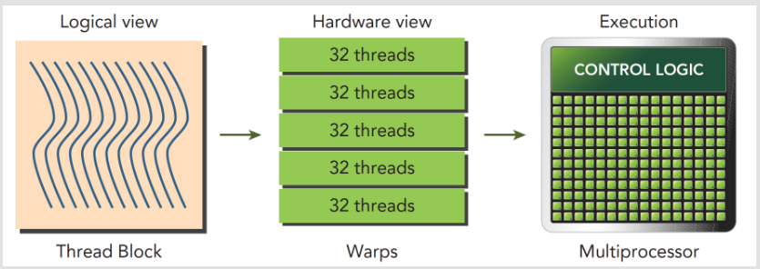
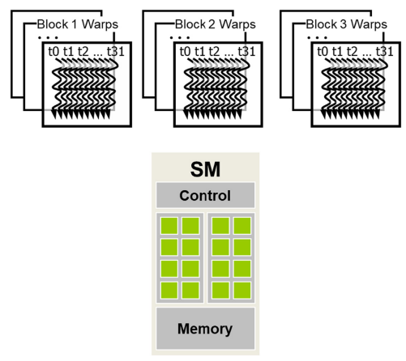

在CUDA编程模型中，**warp**和**SIMD（单指令多数据）硬件**是实现高效并行计算的关键组件。理解这些概念对于优化CUDA程序的性能至关重要。

### 4.4.1 Warps

**Warp**是CUDA中最小的执行单位，由32个线程组成。这些线程执行相同的指令，但可以处理不同的数据。这种设计允许GPU同时处理大量数据，提高了计算效率。

**Warp的执行特点**：
- **单指令多数据（SIMD）**：在同一个warp中，所有线程执行相同的指令，但可以处理不同的数据元素。这种方式提高了内存访问的效率和计算的速度。
- **线程束分化（Warp Divergence）**：如果warp中的线程执行不同的指令路径，会导致线程束分化，从而降低执行效率。因此，设计内核时应尽量避免线程束分化。

### 4.4.2 SIMD Hardware

**SIMD硬件**是指能够同时执行多个数据操作的处理器硬件。在CUDA中，这种硬件通常由多个CUDA核心组成，每个核心可以执行一个线程。

**SIMD硬件的特点**：
- **并行执行**：SIMD硬件能够同时执行多个线程，每个线程执行不同的数据操作，从而提高了处理器的吞吐率。
- **资源共享**：在CUDA中，多个线程块可以共享同一个SM（流多处理器），这使得资源（如寄存器、共享内存）需要在多个线程之间高效共享。

### 4.4.3 Warp调度

在CUDA中，warp调度是确保线程块中的warp有效利用硬件资源的过程。CUDA运行时系统负责将warp分配给SM，并在必要时进行调度，以优化性能。

**Warp调度的关键点**：
- **动态调度**：CUDA运行时系统动态地将warp分配给SM，根据当前的资源利用情况和执行队列的状态进行优化。
- **资源管理**：CUDA运行时需要管理SM上的资源，如寄存器、共享内存和线程槽，以确保所有warp都能高效执行。

CUDA GPU中的线程调度是一个硬件实现概念，因此必须在特定硬件实现的背景下讨论。在迄今为止的大多数实现中，一旦一个块被分配给一个流式多处理器（SM），它就会被进一步划分为32线程单元，称为线程束（warps）。线程束的大小是特定于实现的，并且在未来的GPU代中可能会有所不同。了解线程束可以帮助理解和优化特定代CUDA设备上CUDA应用程序的性能。

一个warp是SM（流多处理器）中线程调度的基本单位。图4.6展示了一个实现中将块划分为warps的方式。在这个例子中，有三个块——块1、块2和块3——都被分配到了一个SM中。这三个块进一步被划分为warps以进行调度。每个warp由连续的32个线程索引值组成：线程0至31形成第一个warp，线程32至63形成第二个warp，依此类推。我们可以计算出在特定的块大小和分配给每个SM的块数量给定的情况下，一个SM中存在的warps数量。在这个例子中，如果每个块有256个线程，我们可以确定每个块有256/32或8个warps。在SM中有三个块的情况下，我们在SM中有8*3=24个warps。

### 4.4.4 优化策略

为了充分利用warp和SIMD硬件的优势，开发者可以采取以下策略：

1. **避免线程束分化**：尽量设计内核，使得同一个warp中的线程执行相同的指令路径。
2. **优化内存访问模式**：确保线程访问内存时能够利用内存的局部性原理，减少内存延迟。
3. **合理使用共享内存**：利用共享内存来存储线程块内的共享数据，减少全局内存访问。
4. **调整线程块大小**：根据GPU的架构和程序的需求，选择合适的线程块大小，以最大化硬件资源的利用率。

通过理解warp和SIMD硬件的工作原理，开发者可以更好地设计和优化CUDA程序，实现高效的并行计算。

在并行计算领域，**单指令多数据（SIMD）**和**单指令多线程（SIMT）**是两种不同的执行模型，它们在处理并行任务时各有优势和特点。下面详细比较这两种模型，并解释SIMT如何提供了比SIMD更高的灵活性和独立性。

### SIMD（单指令多数据）

SIMD是一种并行计算模型，其中单个指令同时作用于多个数据元素。这种模型非常适合于数据并行性高的操作，如数组或矩阵运算。

**SIMD的特点**：
- **指令广播**：相同的指令被广播到多个处理单元，每个单元操作不同的数据。
- **执行死板**：所有处理单元必须执行相同的指令，不允许有分支或不同的操作。
- **高效的数据处理**：在处理大规模数据时，SIMD可以显著提高性能，因为它减少了指令调度和执行的开销。

### SIMT（单指令多线程）

SIMT是CUDA架构中采用的一种执行模型，它允许单个指令由多个线程执行，但线程之间可以有不同的执行路径。

**SIMT的特点**：
- **线程级并行**：每个线程可以独立地执行不同的指令路径，提供了更高的灵活性。
- **独立的寄存器和指令计数器**：每个线程有自己的寄存器状态和指令地址计数器，允许线程独立执行。
- **动态并行**：SIMT支持动态并行，即线程可以生成新的线程，进一步增加了模型的灵活性。

### SIMT vs SIMD

尽管SIMD和SIMT都使用指令广播，但SIMT提供了更高的灵活性和独立性：

1. **指令执行灵活性**：
   - SIMD要求所有处理单元执行相同的指令，不允许分支。
   - SIMT允许线程根据条件选择是否执行某些指令，提供了指令级别的并行性。

2. **线程独立性**：
   - SIMD中的线程没有独立的执行路径，必须同步执行相同的操作。
   - SIMT中的每个线程都有自己的指令地址计数器和寄存器状态，可以独立执行不同的操作。

3. **编程模型**：
   - SIMD编程模型相对简单，但缺乏灵活性。
   - SIMT编程模型提供了更多的控制，允许开发者利用线程间的独立性来优化性能。

### 结论

SIMT模型通过提供每个线程独立的执行路径和寄存器状态，实现了比SIMD更高的灵活性和独立性。这使得SIMT在处理复杂并行任务时更加有效，尤其是在需要动态决策和独立处理不同数据元素的情况下。CUDA架构利用SIMT模型，通过为每个线程提供一个唯一的标号（如`blockIdx`和`threadIdx`），进一步增强了并行计算的灵活性和效率。
