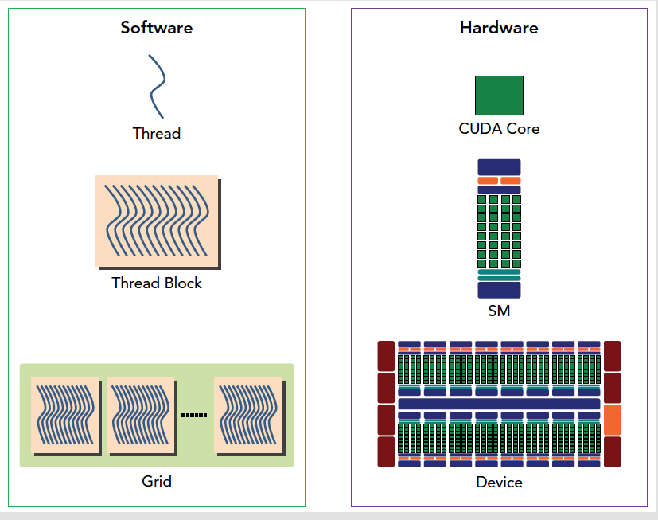

在讲解现代GPU的架构时，我们会涉及到其关键组成部分以及它们是如何协同工作以执行并行计算的。以下是现代GPU架构的详细说明，并以Markdown格式呈现。

## 4-1 现代GPU的架构

现代GPU（图形处理单元）是为了处理大量并行计算任务而设计的处理器。它们通常包含数以千计的更小、更高效的核心，这些核心可以同时处理多个数据点，这使得GPU在执行并行算法时比传统CPU更加高效。

### 关键组件：

1. **流多处理器（Streaming Multiprocessors, SMs）**：
   - 流多处理器是构成GPU的核心部分，每个SM包含多个CUDA核心。
   - SM负责调度线程，执行线程，以及管理寄存器和共享内存。

2. **CUDA核心（CUDA Cores）**：
   - CUDA核心是执行实际计算的单元，每个核心可以执行一个线程。
   - 多个CUDA核心组成一个SM，共同完成复杂的计算任务。

3. **全局内存（Global Memory）**：
   - 全局内存是GPU中最大的内存区域，用于存储输入数据、输出数据和中间计算结果。
   - 由于其高延迟，通常需要通过优化来减少对全局内存的访问。

4. **共享内存（Shared Memory）**：
   - 共享内存是位于SM内部的小型、低延迟内存，用于存储线程块内的数据。
   - 共享内存可以被同一个SM内的所有线程快速访问，用于提高内存访问速度。

5. **寄存器（Registers）**：
   - 每个线程都有自己的一组寄存器，用于存储局部变量和临时数据。
   - 寄存器访问速度非常快，但是数量有限。

6. **常量内存（Constant Memory）**：
   - 常量内存是只读内存，用于存储不会改变的数据，如查找表。
   - 当多个线程读取相同的常量内存地址时，可以实现高效的广播访问。

7. **纹理内存（Texture Memory）**：
   - 纹理内存是用于图形纹理的特殊内存区域，也可以用于通用计算。
   - 它提供了缓存和特定的硬件优化，适合读取规则的数据模式。

8. **L1/L2缓存（L1/L2 Cache）**：
   - 缓存用于减少对全局内存的访问延迟。
   - L1缓存位于SM内部，L2缓存是所有SM共享的。

### 工作方式：

1. **线程束（Warp）**：
   - 一个warp是一组32个线程，它们一起执行相同的指令。
   - warp内的线程通过单指令多数据（SIMD）方式工作。

2. **线程块（Thread Block）**：
   - 线程块是一组线程的集合，它们共同工作以完成一个任务。
   - 线程块的大小通常由32、64或128个线程组成。

3. **网格（Grid）**：
   - 网格是一组线程块的集合，它们共同工作以处理整个数据集。
   - 网格的大小由线程块的数量决定。

4. **执行模型**：
   - GPU使用一种称为单指令多线程（SIMT）的执行模型。
   - 在这种模型中，每个线程独立执行相同的指令，但可以处理不同的数据。

