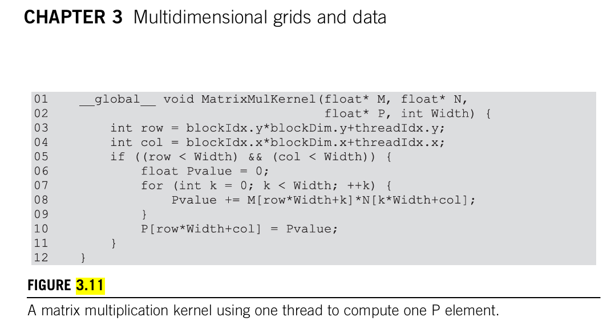
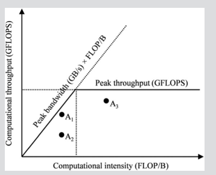

### 5.1 内存架构和数据局部性（Memory Architecture and Data Locality）
| 架构名称 | 代表型号 | 发布年份 | 主要特点 |
| --- | --- | --- | --- |
| Tesla | G80 | 2006 | 第一个实现统一着色器模型的微架构 |
| Fermi | GF100 | 2010 | 提高双精度性能，引入ECC支持，True Cache Hierarchy |
| Kepler | GK104 | 2012 | 减少SM单元数，增加每组SM单元中的CUDA内核数 |
| Maxwell | GM204 | 2014 | 提高能效比，引入Dynamic Super Resolution技术 |
| Pascal | GP104 | 2016 | 引入Tensor Core，支持FP16半精度计算 |
| Volta | GV100 | 2017 | 专为AI和深度学习优化，引入Tensor Core |
| Turing | TU104 | 2018 | 引入RT Core，支持实时光线追踪 |
| Ampere | GA104 | 2020 | 性能大幅提升，引入第三代Tensor Core |
| Hopper | GH100 | 2022 | 专为AI和HPC设计，引入第四代Tensor Core |
FLOP/B。我们将此比率称为计算与全局内存访问比率，定义为程序区域内从全局内存访问每个字节执行的 FLOP 数

减少全局内存访问次数!!!实现更高的性能,充分利用 A100 GPU 提供的 19,500 GFLOPS!!!

正如我们将看到的，矩阵乘法提供了减少全局内存访问的机会，这些机会可以用相对简单的技术来捕获。矩阵乘法函数的执行速度可以变化几个数量级，这取决于全局内存访问的减少程度。因此，矩阵乘法为此类技术提供了一个极好的初始示例。本章介绍了一种常用的减少全局内存访问次数的技术，并演示了矩阵乘法技术。

在循环的每次迭代中，对一个浮点乘法和一个浮点加法执行两次全局内存访问。全局内存访问从 M 和 N 数组中获取元素。浮点乘法操作将这两个元素相乘在一起，浮点加法操作将乘积累加成 Pvalue

从全局内存访问的浮点操作（FLOP）与字节（B）的比率为 2 FLOP 比 8 B，或 0.25 FLOP/B

在现代GPU架构中，内存访问效率对于程序性能至关重要。这是因为GPU通常需要处理大量数据，而这些数据通常存储在全局内存中。全局内存的访问速度相对较慢，且带宽有限，这可能导致GPU的核心在等待数据加载时闲置，从而降低整体的计算效率。

### 内存访问效率的影响因素：

1. **内存访问延迟（Memory Access Latency）**：
   - 内存访问延迟是指从请求数据到数据可用的时间。对于GPU来说，全局内存的访问延迟通常比CPU更高，因为GPU的全局内存通常位于芯片外部，需要通过较长的总线进行数据传输。

2. **内存带宽（Memory Bandwidth）**：
   - 内存带宽是指单位时间内可以传输的数据量。GPU的内存带宽有限，如果数据访问模式不合理，可能会导致内存带宽成为瓶颈，限制了GPU的计算能力。

3. **计算与内存访问比（Compute-to-Memory Access Ratio）**：
   - 这个比率描述了每个内存访问操作中执行的浮点运算次数。一个高比率意味着每个内存访问可以执行更多的计算，从而更有效地利用内存带宽。

4. **内存访问模式（Memory Access Patterns）**：
   - 优化内存访问模式可以显著提高性能。例如，连续访问全局内存中的连续地址可以提高内存访问的效率，因为这样可以利用内存的突发传输特性。

5. **内存层次结构（Memory Hierarchy）**：
   - GPU内存层次结构包括寄存器、共享内存、常量内存、纹理内存、L1缓存、L2缓存和全局内存。每个层次的内存都有其特定的访问延迟和带宽特性。合理利用这些不同层次的内存可以减少对全局内存的依赖，从而提高性能。

### 提高内存访问效率的策略：

1. **减少全局内存访问**：
   - 通过算法优化，减少对全局内存的访问次数，可以减少延迟和提高带宽利用率。

2. **利用共享内存和寄存器**：
   - 将频繁访问的数据存储在共享内存或寄存器中，可以显著减少访问延迟，因为这些内存的访问速度比全局内存快得多。

3. **优化内存访问模式**：
   - 通过调整数据访问模式，使其更加连续和有序，可以提高内存访问的效率，尤其是在全局内存访问中。

4. **使用常量和纹理内存**：
   - 对于不经常变化的数据，可以使用常量内存；对于具有特定读取模式的数据，可以使用纹理内存，以利用这些内存的特殊优化。

5. **缓存利用**：
   - 通过合理使用L1和L2缓存，可以减少对全局内存的访问，从而提高性能。

总的来说，内存访问效率是GPU编程中需要重点考虑的问题。通过优化内存访问，可以显著提高GPU程序的性能，使其更接近硬件的理论计算能力。

计算强度（Computational Intensity）和计算吞吐量（Computational Throughput）是衡量计算性能的两个重要概念，它们描述了计算任务的不同方面：

1. **计算强度（Computational Intensity）**：
   - 计算强度是指每个字节（Byte）数据加载到处理器时所执行的浮点运算次数（FLOP/B，即Floating Point Operations per Byte）。
   - 它反映了程序的“计算密度”，即对于每单位数据，程序执行了多少计算工作。
   - 计算强度越高，意味着对于每字节的数据，程序执行了更多的浮点运算。
   - 计算强度是衡量程序是否为计算密集型或内存密集型的关键指标。如果计算强度低，程序可能受到内存带宽的限制；如果计算强度高，程序可能受到处理器计算能力的限制。

2. **计算吞吐量（Computational Throughput）**：
   - 计算吞吐量是指处理器或计算系统在单位时间内能完成的浮点运算次数，通常以每秒浮点运算次数（FLOPS，即Floating Point Operations per Second）来衡量。
   - 它反映了硬件的计算能力，即在给定时间内能处理多少计算工作。
   - 计算吞吐量越高，意味着硬件的计算能力越强。
   - 计算吞吐量是衡量硬件性能的直接指标，它受到处理器核心数量、时钟频率、内存带宽等多种因素的影响。

简而言之，计算强度更多地关注于单个数据项上执行的计算工作量，而计算吞吐量则关注于整个系统在单位时间内能完成的总计算工作量。两者共同决定了程序在特定硬件上的性能表现。通过分析这两个指标，开发者可以识别程序的性能瓶颈，并采取相应的优化措施。

