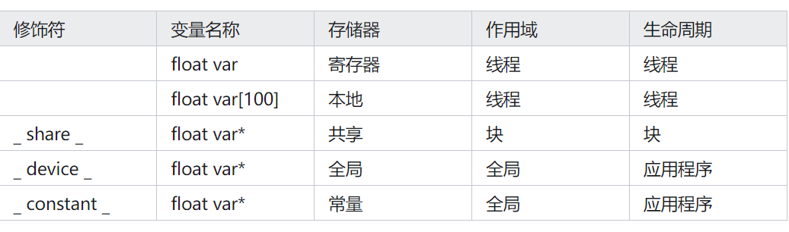

### 5.2 CUDA内存类型（CUDA Memory Types）

在CUDA编程中，了解和正确使用不同的内存类型对于优化GPU程序的性能至关重要。本节将详细介绍CUDA中不同类型的内存及其使用方法。

#### 1. 全局内存（Global Memory）

全局内存是CUDA设备上最大的内存区域，由所有线程共享。它通常位于GPU外部的DRAM中，因此访问速度相对较慢。全局内存适用于存储大量数据，但程序员需要通过优化内存访问模式（如分块和预取）来减少访问延迟。

#### 2. 共享内存（Shared Memory）

共享内存是一种位于GPU片上的快速内存，由同一个线程块（thread block）内的所有线程共享。它比全局内存有更低的访问延迟和更高的带宽。共享内存适用于线程间的数据共享，可以显著提高数据重用和减少全局内存访问。

- **声明共享内存**：使用`__shared__`关键字声明共享内存变量。
- **访问共享内存**：所有线程都可以访问共享内存中的变量，但需要通过正确的索引来访问。

#### 3. 寄存器（Registers）

寄存器是每个线程私有的高速存储区域，用于存储局部变量和频繁访问的数据。寄存器的访问速度非常快，但数量有限。如果一个线程使用了过多的寄存器，可能会导致寄存器溢出到局部内存，从而降低性能。

- **声明寄存器变量**：在CUDA内核函数中声明的局部变量默认存储在寄存器中。

#### 4. 常量内存（Constant Memory）

常量内存是一种只读内存，适用于存储不会改变的数据，如数组的大小或其他常量。常量内存的访问速度比全局内存快，但比共享内存和寄存器慢。常量内存适用于存储全局常量数据，可以被所有线程高效访问。

- **声明常量内存**：使用`__constant__`关键字声明常量内存变量。
- **访问常量内存**：所有线程都可以访问常量内存中的变量，但只能读取不能修改。

#### 5. 纹理内存（Texture Memory）

纹理内存是一种特殊的缓存内存，主要用于图形纹理数据。它也可以用于一般计算，特别是对于具有空间局部性的数据访问模式。纹理内存通过缓存最近访问的数据来提高访问速度。

- **声明纹理内存**：使用`__texture__`关键字声明纹理内存变量。
- **访问纹理内存**：通过纹理坐标访问纹理内存中的变量。

CPU 和 GPU 的不同设计目标导致了不同的寄存器架构。正如我们在第 4 章，计算架构和调度中看到的，当 CPU 上下文在不同线程之间切换时，它们将传出线程的寄存器保存到内存中，并从内存中恢复传入线程的寄存器。相比之下，GPU 通过将处理块上调度的所有线程的寄存器保存在处理块的寄存器文件中来实现零开销调度。这样，线程扭曲之间的切换是瞬时的，因为传入线程的寄存器已经在寄存器文件中。
因此，GPU 寄存器文件需要比 CPU 寄存器文件大得多。
我们还在第 4 章计算架构和调度中看到，GPU 支持动态资源分区，其中 SM 可能为每个线程配置很少的寄存器并执行大量线程，或者我为每个线程配置更多的寄存器并执行更少的线程。因此，GPU 寄存器文件需要设计为支持寄存器的这种动态分区。相比之下，CPU 寄存器架构为每个线程指定一组固定的寄存器，而不管线程对寄存器的实际需求如何。

