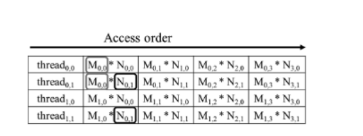

当然，让我们更详细地探讨如何使用共享内存（shared memory）来减少全局内存流量，这种方法通常被称为平铺（tiling）或分块（blocking）。


### 为什么使用共享内存平铺？

在GPU上执行的计算中，内存访问是一个主要的性能瓶颈。全局内存虽然容量大，但其访问延迟高且带宽有限。共享内存位于GPU芯片上，其访问速度远快于全局内存，但容量较小。通过将数据从全局内存复制到共享内存，然后让线程块内的线程重复利用这些数据，可以显著减少对全局内存的访问次数，从而提高性能。

### 共享内存平铺的步骤

1. **确定平铺尺寸**：
   - 选择一个合适的平铺尺寸（tile size），这通常取决于共享内存的大小和线程块的配置。平铺尺寸应该足够大，以便充分利用共享内存，但又不能太大，以免超出共享内存的容量。

2. **划分数据**：
   - 将大矩阵划分为多个小块（tiles），每个小块的尺寸等于平铺尺寸。这些小块将被加载到共享内存中。

3. **加载数据到共享内存**：
   - 每个线程块负责将其对应的数据块从全局内存加载到共享内存。这通常在核心的执行配置中完成，每个线程加载一个或多个元素到共享内存。

4. **同步线程**：
   - 使用`__syncthreads()`函数确保所有线程都完成了数据加载，这样在进行计算之前，共享内存中的数据是完整的。

5. **执行计算**：
   - 线程块内的线程使用共享内存中的数据进行计算。由于数据已经在共享内存中，这些操作可以快速执行。

6. **写回结果**：
   - 计算完成后，将结果从共享内存写回全局内存。

### 共享内存平铺的示例

假设我们要执行一个矩阵乘法，我们可以按照以下步骤使用共享内存平铺：

```cuda
__global__ void matrixMultiply(const float *A, const float *B, float *C, int width) {
    // 定义平铺尺寸
    const int TILE_SIZE = 16;
    
    // 计算线程在矩阵中的位置
    int row = blockIdx.y * TILE_SIZE + threadIdx.y;
    int col = blockIdx.x * TILE_SIZE + threadIdx.x;
    
    // 初始化累加器
    float acc = 0.0;
    
    // 定义共享内存数组
    __shared__ float As[TILE_SIZE][TILE_SIZE];
    __shared__ float Bs[TILE_SIZE][TILE_SIZE];
    
    // 遍历平铺
    for (int m = 0; m < width; m += TILE_SIZE) {
        // 加载A和B的平铺到共享内存
        if (row < width && m + threadIdx.x < width) {
            As[threadIdx.y][threadIdx.x] = A[(row + m) * width + threadIdx.x + m];
        }
        if (m + threadIdx.y < width && col < width) {
            Bs[threadIdx.y][threadIdx.x] = B[(threadIdx.y + m) * width + col];
        }
        
        // 同步所有线程
        __syncthreads();
        
        // 执行计算
        for (int n = 0; n < TILE_SIZE; ++n) {
            acc += As[threadIdx.y][n] * Bs[n][threadIdx.x];
        }
        
        // 同步所有线程
        __syncthreads();
    }
    
    // 将结果写回全局内存
    if (row < width && col < width) {
        C[row * width + col] = acc;
    }
}
```

### 注意事项

- **共享内存容量**：确保使用的共享内存不超过GPU的限制。
- **边界条件**：正确处理矩阵边缘的平铺，避免越界访问。
- **性能调优**：平铺尺寸和线程块配置可能需要根据具体的GPU架构和问题规模进行调整。

通过这种方法，我们可以显著减少全局内存的访问次数，利用共享内存的高带宽和低延迟特性，从而提高程序的整体性能。
