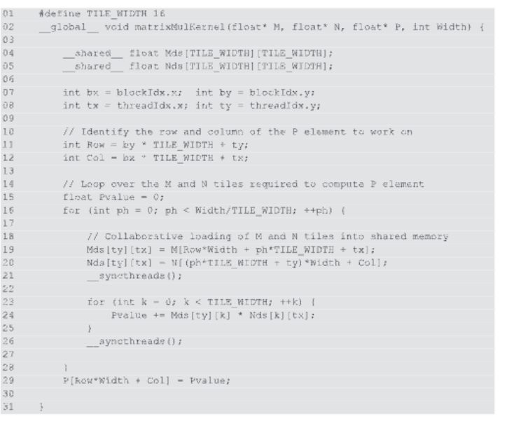

### 平铺算法的优势

平铺算法在处理矩阵乘法时展现出显著的优势，主要体现在以下几个方面：

- **减少全局内存访问量**：通过使用平铺算法，全局内存的访问量可以减少 `TILE_WIDTH` 倍。例如，使用 `16 x 16` 的图块，可以将全局内存访问减少 16 倍。

- **提高计算与全局内存访问比率**：这种减少使得计算与全局内存访问的比率从 0.25 OP/B 提升到 4 OP/B。

- **支持更高的计算速率**：上述改进使得 CUDA 设备的内存带宽能够支持更高的计算速率。

### 实际案例：A100 GPU

以 A100 GPU 为例，其全局内存带宽为 1555 GB/秒，使用平铺算法后，设备能够实现的计算性能有显著提升：

- **计算性能提升**：通过平铺算法，A100 GPU 的计算性能可以从 389 GFLOPS 提升到 `(1555 GB/秒) * (4 OP/B) = 6220 GFLOPS`。
### 平铺算法的优势

平铺算法在处理矩阵乘法时展现出显著的优势，主要体现在以下几个方面：

- **减少全局内存访问量**：通过使用平铺算法，全局内存的访问量可以减少 `TILE_WIDTH` 倍。例如，使用 `4 x 4` 的图块，可以将全局内存访问减少 16 倍。

- **提高计算与全局内存访问比率**：这种减少使得计算与全局内存访问的比率从 0.25 OP/B 提升到 4 OP/B。

- **支持更高的计算速率**：上述改进使得 CUDA 设备的内存带宽能够支持更高的计算速率。

### 实际案例：A100 GPU

以 A100 GPU 为例，其全局内存带宽为 1555 GB/秒，使用平铺算法后，设备能够实现的计算性能有显著提升：

- **计算性能提升**：通过平铺算法，A100 GPU 的计算性能可以从 389 GFLOPS 提升到 `(1555 GB/秒) * (4 OP/B) = 6220 GFLOPS`。

## 5.4 分块矩阵乘法核心（Tiled Matrix Multiplication Kernel）

在介绍了分块技术（Tiling）的基本概念和动机之后，让我们深入探讨如何实现一个分块矩阵乘法的核心（kernel）。分块矩阵乘法核心是通过将矩阵划分为小块（tiles），并利用共享内存来减少全局内存访问，从而提高矩阵乘法的性能。

### 实现分块矩阵乘法核心的步骤

1. **定义分块大小**：
   - 首先，我们需要确定每个分块的大小。这个大小取决于共享内存的容量和线程块的配置。例如，如果我们选择的分块大小为`16x16`，那么每个线程块将处理一个`16x16`的输出矩阵块。

2. **加载数据到共享内存**：
   - 每个线程块将负责加载相应的矩阵分块到共享内存中。这涉及到从全局内存中加载矩阵`M`和`N`的相应分块到共享内存数组`Mds`和`Nds`中。

3. **执行乘法运算**：
   - 一旦数据被加载到共享内存中，线程块内的线程就可以开始执行矩阵乘法运算。每个线程计算输出矩阵`P`中的一个元素，通过取`M`的一个行分块和`N`的一个列分块的点积来实现。

4. **写回结果**：
   - 计算完成后，将结果从共享内存写回全局内存中的输出矩阵`P`。

### 分块矩阵乘法核心的代码示例

以下是使用分块技术的矩阵乘法核心的一个简化示例：

```cuda
__global__ void matrixMultiply(const float *M, const float *N, float *P, int width) {
    // 定义分块大小
    const int TILE_WIDTH = 16;

    // 计算线程在输出矩阵中的位置
    int row = blockIdx.y * TILE_WIDTH + threadIdx.y;
    int col = blockIdx.x * TILE_WIDTH + threadIdx.x;

    // 初始化累加器
    float Pvalue = 0;

    // 定义共享内存数组
    __shared__ float Mds[TILE_WIDTH][TILE_WIDTH];
    __shared__ float Nds[TILE_WIDTH][TILE_WIDTH];

    // 遍历矩阵分块
    for (int m = 0; m < width; m += TILE_WIDTH) {
        // 加载M和N的分块到共享内存
        Mds[threadIdx.y][threadIdx.x] = M[(row + m) * width + col];
        Nds[threadIdx.y][threadIdx.x] = N[(row + m) * width + threadIdx.x];

        // 同步所有线程以确保数据加载完成
        __syncthreads();

        // 执行点积运算
        for (int k = 0; k < TILE_WIDTH; ++k) {
            Pvalue += Mds[threadIdx.y][k] * Nds[k][threadIdx.x];
        }

        // 同步所有线程以确保计算完成
        __syncthreads();
    }

    // 将结果写回全局内存
    if (row < width && col < width) {
        P[row * width + col] = Pvalue;
    }
}
```

### 分块矩阵乘法核心的优势

- **减少全局内存访问**：通过将数据加载到共享内存中，每个线程块可以减少对全局内存的访问次数。
- **提高数据重用**：线程可以重复利用共享内存中的数据，而不需要每次都从全局内存中加载。
- **提高内存带宽利用率**：分块技术可以提高内存带宽的利用率，因为共享内存的带宽远高于全局内存。

### 注意事项

- **共享内存容量限制**：需要确保共享内存的使用不超过GPU的限制。
- **边界条件处理**：在处理矩阵的边缘分块时，需要特别注意边界条件，以避免访问超出矩阵范围的内存。
- **线程块配置**：线程块的大小和配置需要根据具体的GPU架构和问题规模来调整，以达到最佳的性能。

通过使用分块技术，我们可以显著提高矩阵乘法的性能，使其更接近GPU的峰值计算能力。这种技术是CUDA编程中提高内存访问效率的关键策略之一。
