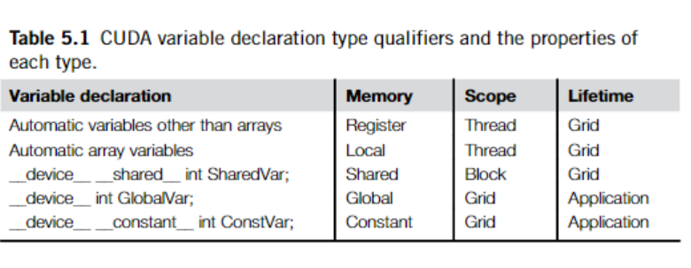
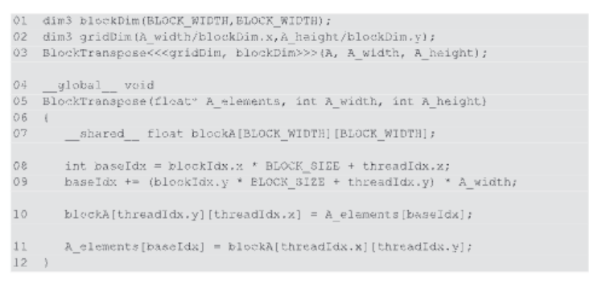

练习

1. 考虑矩阵加法。是否可以使用共享内存来减少全局内存带宽消耗？提示：分析每个线程访问的元素，并查看线程之间是否存在任何共同性。
不可以
2. 画出图5.7的等效图，用于8×8矩阵乘法，采用2×2平铺和4×4平铺。验证全局内存带宽的减少与平铺的尺寸大小成比例。
减少 1/N 倍
3. 如果忘记在图5.9的内核中使用___syncthreads()，可能会发生哪种错误的执行行为？
   threads would load the elements too early and corrupt the input values of other threads.
4. 假设寄存器或共享内存的容量不是问题，给出一个重要原因，为什么使用共享内存而不是寄存器来保存从全局内存获取的值是有价值的？解释你的答案。
Shared memory can be utilized by all threads in one block. But registers are private to one thread. 
 
5. 对于我们的平铺矩阵-矩阵乘法内核，如果我们使用32×32平铺，输入矩阵M和N的内存带宽使用减少了多少？
1/32
6. 假设一个CUDA内核以1000个线程块启动，每个块有512个线程。如果一个变量在内核中被声明为局部变量，内核执行期间将创建该变量的多少个版本？
1000*512
7. 在前一个问题中，如果一个变量被声明为共享内存变量，内核执行期间将创建该变量的多少个版本？
1000
8. 考虑执行两个输入矩阵的矩阵乘法，其维度为N×N。当：
   a. 没有使用平铺。
   b. 使用了大小为T×T的平铺。
   输入矩阵中的每个元素从全局内存请求了多少次？ a.N N/T
9. 一个内核执行36次浮点运算和7次32位全局内存访问。对于以下每种设备属性，指出该内核是计算受限还是内存受限。
   a. 峰值FLOPS=200 GFLOPS，峰值内存带宽=100 GB/秒
   b. 峰值FLOPS=300 GFLOPS，峰值内存带宽=250 GB/秒
36 / (7 * 4) * 100 = 128.5 < 200 | 内存受限
36 / (7 * 4) * 250 = 320 > 300|b 计算受限
10. 为了操作平铺，一位新的CUDA程序员编写了一个设备内核，该内核将每个平铺转置为一个矩阵。平铺的大小为BLOCK_WIDTH乘以BLOCK_WIDTH，矩阵A的每个维度都是BLOCK_WIDTH的倍数。内核的调用和代码如下所示。BLOCK_WIDTH在编译时已知，可以设置为1到20之间的任何值。

a. 在可能的 BLOCK_SIZE 值范围内，对于哪些 BLOCK_SIZE 值，这个内核函数将在设备上正确执行？

b. 如果代码在所有 BLOCK_SIZE 值下都不能正确执行，导致这种不正确执行行为的根本原因是什么？建议对代码进行修改，使其适用于所有 BLOCK_SIZE 值。

11. 考虑以下 CUDA 内核及其调用它的相应主机函数：
