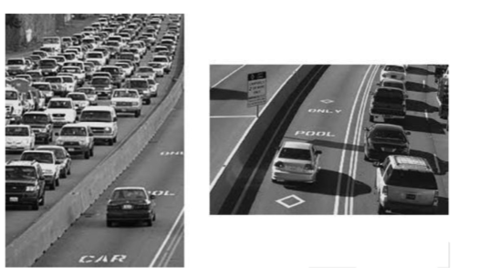

在第 5 章 “内存架构与数据局部性” 中，我们研究了利用共享内存来减少每个线程块中的一组线程必须从全局内存访问的数据总量的分块技术。在本章中，我们将进一步讨论以高效方式在全局内存与共享内存或寄存器之间移动数据的内存合并技术。内存合并技术通常与分块技术结合使用，以使 CUDA 设备通过有效利用全局内存带宽来发挥其性能潜力。

图 6.3 说明了当矩阵以列主顺序存储时，连续线程如何遍历连续列。图 6.3 的左上部分显示了代码，右上部分显示了内存访问的逻辑视图。程序仍在尝试让每个线程访问矩阵 M 的一列。通过检查代码可以看出对 M 的访问不利于合并。数组 M 的索引是 colWidth+k。和以前一样，col 被定义为 block Idx. xblock Dim.x+threadIdx.x，这意味着连续线程（具有连续的 threadIdx.x 值）将具有连续的 col 值。但是，在 M 的索引中，col 乘以 Width，这意味着连续线程将访问 M 中 Width 相距的元素。因此访问不利于合并。

这个图也解释了 第三章的exercise 的练习题 第一题 

=========

当Matrix was stored in column-major order instead of row-major order 时候怎么办？

 - 另一种策略是重新排列数据本身的布局。我们将在第 6.4 节中讨论这些策略
 - 另一种是在共享内存中执行不利的访问模式

内存合并的主要优点是，它通过将多个内存访问合并为单个访问来减少全局内存流量。访问可以在同时发生时进行组合，并访问相邻的内存位置。交通拥堵不仅仅出现在计算中。我们大多数人都经历过高速公路系统中的交通拥堵，如图 6.5 所示。高速公路交通拥堵的根本原因是有太多的汽车都试图在为更少数量的车辆设计的道路上行驶。当拥堵发生时，每辆车的行驶时间大大增加。当交通拥堵时，通勤上班时间很容易增加一倍或三倍。
大多数减少交通拥堵的解决方案都包括减少路上的汽车数量。假设通勤者的数量不变，人们需要共享乘车，以减少路上的汽车数量。共享乘车的一种常见方式是拼车，即一群通勤者的成员轮流驾驶一辆车去上班。政府通常需要制定鼓励拼车的政策。在一些国家，政府简单地禁止某些类别的汽车每天上路。例如，周一、周三或周五可能不允许车牌号为奇数的汽车上路。这鼓励那些在不同日子允许汽车的人组成拼车团体。在其他国家，政府可能会为减少汽车数量的行为提供激励道路。例如，在某些国家，拥挤的高速公路的一些车道被指定为拼车车道；只有两三个人以上的汽车才被允许使用这些车道。还有一些国家，政府使汽油变得如此昂贵，以至于人们为了省钱而组成拼车。

1 最近的 CUDA 设备使用片上缓存来存储全局内存数据。此类缓存会自动合并更多内核访问模式，并在一定程度上减少程序员手动重新排列访问模式的需要。
但是，即使使用缓存，合并技术在可预见的未来仍将对内核执行性能产生重大影响。

本质上内存合并为什么加速？是用来GPU 硬件层面的特性
每次访问 DRAM 位置时，都会访问包括所请求位置在内的一系列连续位置。每个 DRAM 芯片中都提供许多传感器，它们都并行工作。每个传感器都会感测这些连续位置内一位的内容。一旦被传感器检测到，来自所有这些连续位置的数据都可以高速传输到处理器。这些被访问和传递的连续位置称为 DRAM 突发。如果应用程序集中使用这些突发中的数据，DRAM 可以以比访问真正随机的位置序列时高得多的速率提供数据。