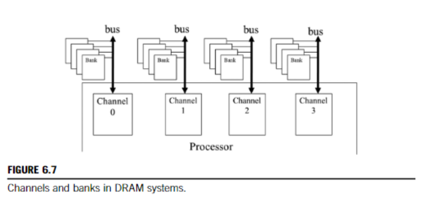
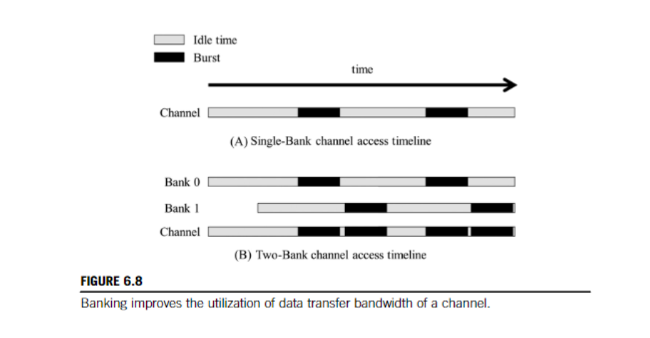

## 6.2 隐藏内存延迟

正如我们在第 6.1 节中解释的那样，DRAM 突发是一种并行组织形式：在 DRAM 核心阵列中并行访问多个位置。然而，仅突发不足以实现现代处理器所需的 DRAM 访问带宽水平。
DRAM 系统通常采用另外两种并行组织形式：存储体和通道。在最高级别，处理器包含一个或多个通道。

总线将一组 DRAM 存储体连接到处理器。
处理器包含一个或多个通道。每个通道都是一个内存控制器

总线的数据传输带宽由其宽度和时钟频率定义。现代双倍数据速率（DDR）总线每个时钟周期执行两次数据传输：一次在每个时钟周期的上升沿，一次在下降沿。例如，一条时钟频率为\(1\)GHz的\(64\)位DDR总线的带宽为\(8\)字节\(\times2\times1\)GHz = \(16\)GB/s。这个数字看似很大，但对于现代CPU和GPU来说往往太小。
现代CPU可能需要至少\(32\)GB/s的内存带宽，而现代GPU可能需要\(256\)GB/s。对于这个例子，CPU需要\(2\)个通道，GPU需要\(16\)个通道。

